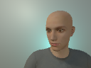
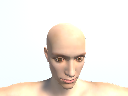

# GazeNet

GazeNet tracks the gaze location of a laptop user using the image from their webcam.
Rather than collecting a large dataset of user data, GazeNet is trained using a combination of large synthetic
or "fake" datasets and smaller dataset of real images.
 
### Fake Images

Fake images are generated automatically using Unity3D. I make use of the free 
[MCS Male](https://assetstore.unity.com/packages/3d/characters/humanoids/mcs-male-45805) character
 model to easily generate over 10,000 synthetic training images. Simulation is an easy way to generate
 large datasets
 
 
 
 
   
### Real Images

Real images are collected using a custom utility `collect_gazedata.py`. This utility uses OpenCV to plot
gaze locations on the screen and takes a picture of the laptop user as they look at these gaze locations.
Real data collection is expensive and uses precious time.
 
 
 
 
 
### Instructions

- Use `collect_gazedata.py` to collect a real dataset. Follow the instructions in the pop-up.
- Build and run the Unity simulator to create an arbitrarily large synthetic dataset.
- Use `train_gazenet.py` to train a GazeNet (uses pre-trained feature extractors).
- Use `run_gazenet.py` to run your GazeNet. Hopefully the green dot on the screen tracks your gaze!
 
## Requirements

- Python 3.6
- [PyTorch](http://pytorch.org/) 0.3.0.post4
- [Unity](https://unity3d.com/) 2017.3
- [OpenCV](https://opencv.org/opencv-3-3.html) 3.0
- [tensorboardX](https://github.com/lanpa/tensorboard-pytorch/tree/master/tensorboardX)

## Sources

[1] [Learning from Simulated and Unsupervised Images through Adversarial Training](https://arxiv.org/abs/1612.07828).
[2] [Eye Tracking for Everyone](http://gazecapture.csail.mit.edu/)