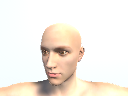

# GazeNet

GazeNet tracks the gaze location of a user using the image from the webcam of their laptop.
Rather than collecting a large dataset of user data, GazeNet is pre-trained using many synthetic images
 from a Unity simulator and then trained with a smaller dataset of real images.
 
 
 

## Requirements

- Python 3.5
- [TensorFlow](https://www.tensorflow.org/) 0.14
- [Unity](blank) 2017.3
- [OpenCV](blank) 3.0

## Sources

[1] [Learning from Simulated and Unsupervised Images through Adversarial Training](https://arxiv.org/abs/1612.07828).

## Author

Hugo Ponte
